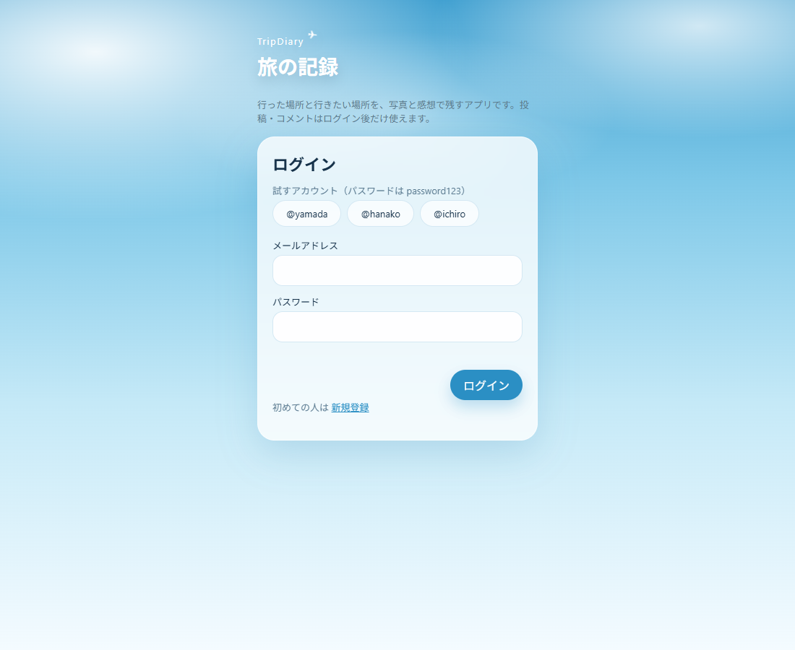
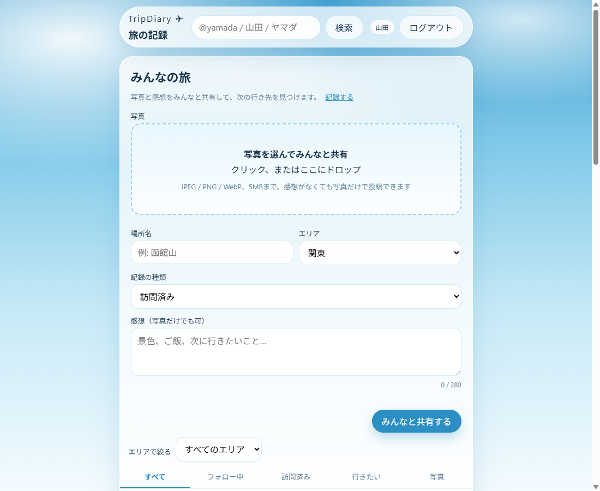
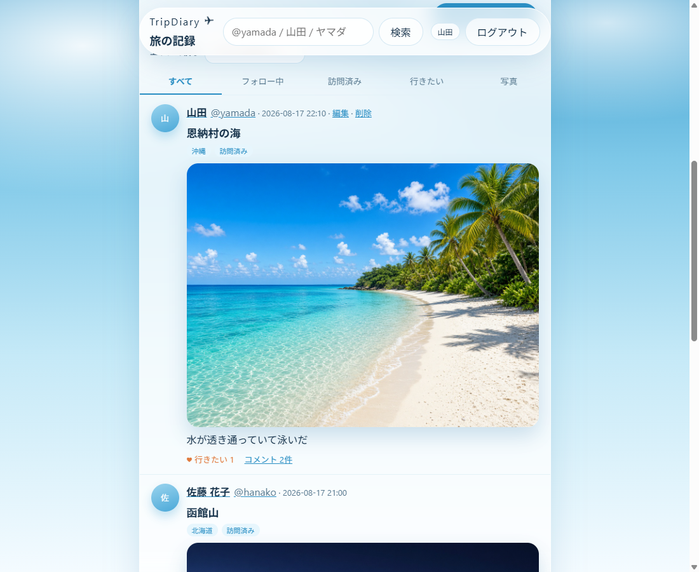
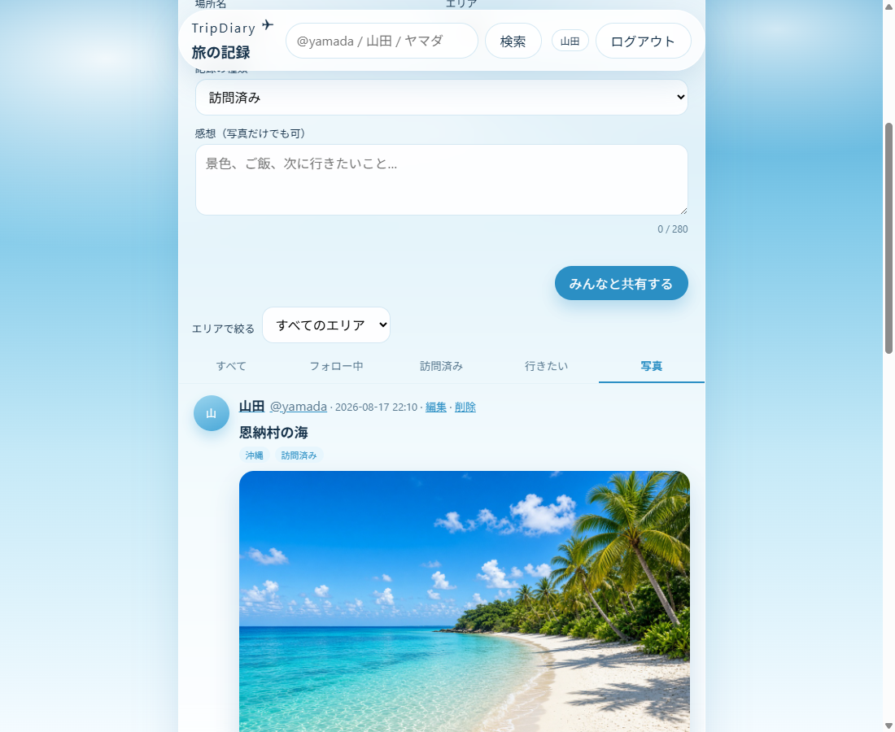
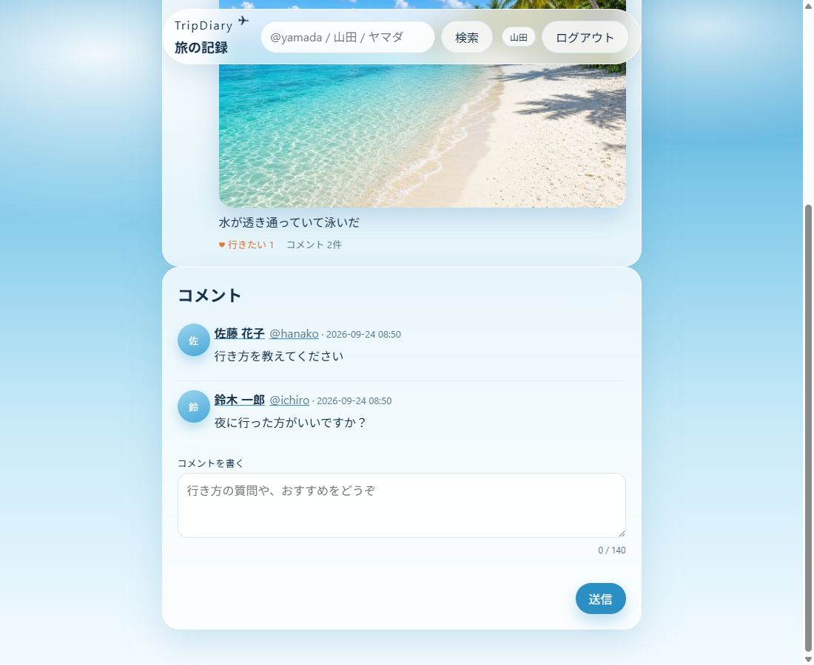
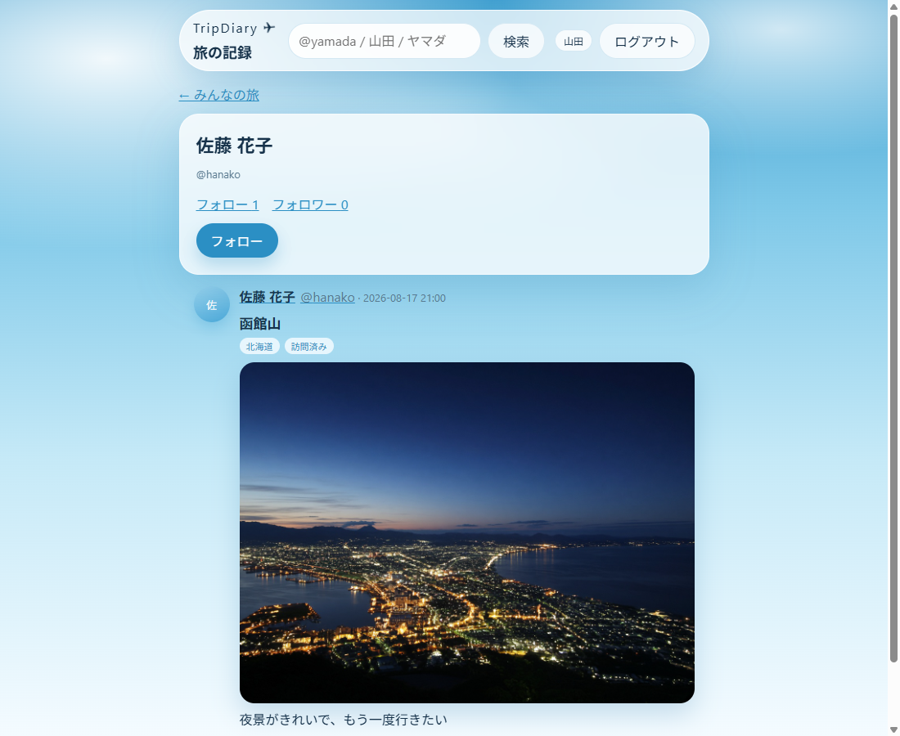
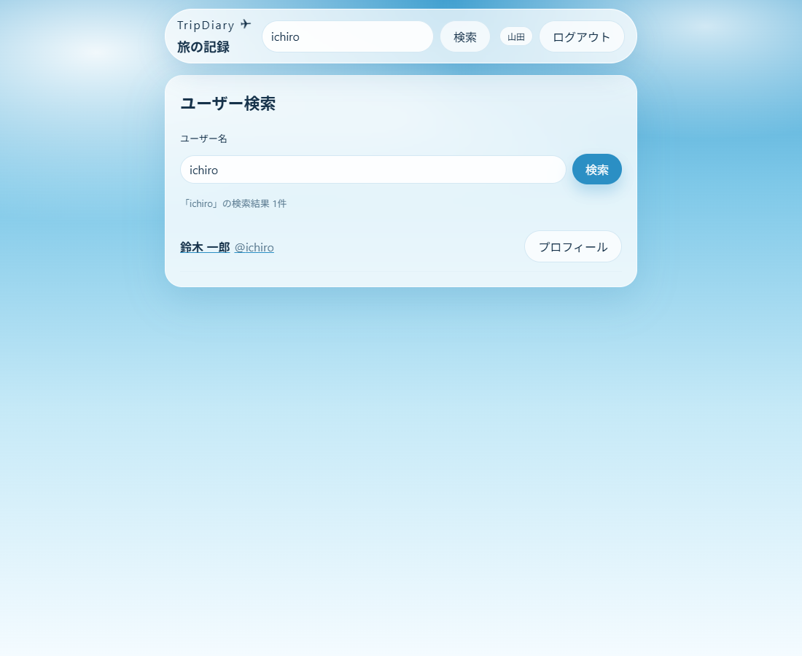

# TripDiary — 旅の記録

行った場所と行きたい場所を、写真と感想で残すアプリです。公開した記録はみんなの記録に並び、非公開の記録は本人だけが見られます。

中級編最終課題の作品です。動作確認は自分のPCで行います。画面の様子は下の画像です。AWS に常時公開していないので、月額課金は出ません。

## 目次

- [確認の入り口](#確認の入り口)
- [動作の様子](#動作の様子)
- [主な機能](#主な機能)
- [技術スタック](#技術スタック)
- [ドキュメント](#ドキュメント)
- [ローカルで動かす](#ローカルで動かす)
- [主なコマンド](#主なコマンド)
- [CI](#ci)
- [パフォーマンステスト](#パフォーマンステスト)
- [ディレクトリ構成](#ディレクトリ構成)
- [AWS は定義だけ](#aws-は定義だけ)
- [セキュリティ](#セキュリティ)

## 確認の入り口

公開URLは置いていません。次のアドレスを、API と画面を起動したPCで開きます。

- 画面: http://127.0.0.1:5173/login
- API の説明（Swagger）: http://127.0.0.1:8080/swagger-ui.html

パスワードはどれも `password123` です。

| ボタン | メール | 表示名 |
|--------|--------|--------|
| `@yamada` | `yamada@example.com` | 山田 |
| `@hanako` | `hanako@example.com` | 佐藤 花子 |
| `@ichiro` | `ichiro@example.com` | 鈴木 一郎 |

最初から入っている記録は、恩納村の海・函館山・金閣寺です。ログインしていない状態で http://127.0.0.1:8080/api/posts を開くと 401 になります。

## 動作の様子

2026-09-26 に、手元の画面で `@yamada` として操作したときの画像です。

### ログイン



### 記録を書く

場所名・エリア・訪問済みか行きたいか・感想・写真を入れて共有します。感想がなくても、写真だけ送れます。地図をクリックすると、その場所の緯度と経度が付きます。公開にするとみんなの記録へ、非公開にすると自分の訪問済みだけに残ります。



### みんなの記録

公開された記録が、新しい順に並びます。非公開の記録はここには出ません。



タブは「みんなの記録 / フォロー中 / 訪問済み / 行きたい / 写真 / お気に入り」です。下は写真タブです。



### コメントといいね

公開中の記録に、行きたい（いいね）とコメントを付けられます。



### プロフィールとフォロー

名前を押すと、その人の公開中の記録へ進み、フォローできます。自分のプロフィールには非公開も出ます。



### ユーザー検索



お気に入りは☆で保存します。一覧は押した本人だけが見られます。

## 主な機能

| 区分 | 内容 |
|------|------|
| 認証 | 新規登録、ログイン、ログアウト。JWT |
| 記録 | 場所名・エリア・訪問済み / 行きたい・感想・写真1枚（JPEG / PNG / WebP、5MB）の作成・編集・削除。感想がなくても写真だけで投稿できる |
| 地図 | 地図をクリックして緯度・経度を付ける。OpenStreetMap |
| 公開 | 記録ごとに公開 / 非公開。みんなの記録に出るのは公開だけ |
| いいね | 公開中の記録への「行きたい」。1人1回。件数は一覧に出る |
| コメント | 公開中の記録へ。1〜140文字。自分のコメントは削除できる |
| お気に入り | 記録を保存。一覧は本人だけ |
| フォロー | フォロー / 解除。件数と一覧。プロフィールには公開中の記録 |
| 絞り込み | みんなの記録 / フォロー中 / 訪問済み / 行きたい / 写真 / お気に入り。エリアでも絞れる |
| 旅行案内 | 「旅行プラン」の地図と、そらとの相談。世界の観光地と有名なところを、会話で案内する |
| 一覧の続き | 下へ進むと古い記録が続く。自分の操作は直後に反映する。他の人の変更は約30秒おきに静かに取り直す |

行きたい数とコメント数は、記録を1件ずつ取りに行かず、一覧の同じ取得で数えます。

## 技術スタック

| 層 | 中身 |
|----|------|
| 画面 | React 19.2.8、Vite 6.4.3、TypeScript 5.7.3、Leaflet 1.9.4。ポート 5173 |
| API | Java 21、Spring Boot 3.4.5、MyBatis、Bean Validation。ポート 8080 |
| 認証 | JWT（アクセスとリフレッシュ）。パスワードは BCrypt |
| DB | 起動時は SQLite。テストは H2。スキーマは Flyway |
| 画像 | 起動中は `uploads/`（Git には入れない）。最初の写真は `backend/src/main/resources/seed-photos/` |
| テスト | バックエンド 151、フロント 47（提出時点から、公開設定・お気に入りのテストを追加） |
| CI | `.github/workflows/ci.yml`。push と pull request でテストが動く |
| ログ | `backend/logs/` の JSON。パスワード・トークン・本文は出さない |
| 地図 | Leaflet + OpenStreetMap。API キーは不要 |
| AWS | `infra/terraform/` に定義だけ。既定では何も作らない |

## ドキュメント

| 資料 | 内容 |
|------|------|
| [docs/verify.md](docs/verify.md) | 授業で聞かれたときの答え |
| [infra/terraform/README.md](infra/terraform/README.md) | AWS の定義と、課金しないための設定 |
| Swagger | 起動中の http://127.0.0.1:8080/swagger-ui.html |

## ローカルで動かす

必要なもの: Java 21、Node.js。`.env` は無くても起動します。データベース用の別ソフトは要りません。

```powershell
cd backend
.\mvnw.cmd -Dmaven.test.skip=true spring-boot:run
```

```powershell
cd frontend
npm install
npm run dev
```

止めるときは、それぞれのターミナルで Ctrl+C です。

## 主なコマンド

```powershell
cd backend
.\mvnw.cmd test
```

```powershell
cd frontend
npm test
```

テストは H2 と Vitest で行い、手元の SQLite には書きません。

## CI

`.github/workflows/ci.yml`

- push と pull request で GitHub Actions が動く
- バックエンド: Java 21 で `./mvnw -B test`（Checkstyle を含む）
- フロント: Node 22 で `npm ci`、型チェック、`npm test`
- k6 と Playwright は毎回の CI には載せない

## パフォーマンステスト

毎回のテストには載せません。見るものは P50 / P95 / P99 です。

```powershell
k6 run perf/k6-timeline.js
```

ブラウザで一連の操作を見る場合は、任意で `e2e/playwright.spec.ts` を使えます。CI には載せていません。

## ディレクトリ構成

```
frontend/          画面（React）
backend/           API（Spring Boot）
docs/              確認ガイドと画面画像
docs/images/       動作確認の画面
e2e/               Playwright（任意）
perf/              k6（任意）
infra/terraform/   AWS の定義だけ
prototype/         見た目確認用の HTML
.github/workflows/ CI
```

## AWS は定義だけ

授業で扱う構成（画面は S3 + CloudFront、API は Fargate、DB は RDS PostgreSQL、画像は S3、前段は ALB）は `infra/terraform/` に書いてあります。

1. `enable_infra` の既定は false。普通に apply しても AWS に何も立たない
2. NAT Gateway は入れない
3. Fargate の `desired_count` の既定は 0

このリポジトリでは `terraform apply` して残しません。動作確認は、上の画像とローカルの 5173 / 8080 で足ります。

## セキュリティ

- パスワードとトークンは、レスポンスにもログにも出しません
- 未ログインの記録 API は 401 です
- 他人の記録は編集・削除できません
- 非公開の記録は、本人以外には一覧にも詳細にも出ません。いいねとコメントは公開中だけです
- お気に入りの一覧は、保存した本人だけが見られます
- アクセスキーや JWT の秘密鍵は Git に書きません
